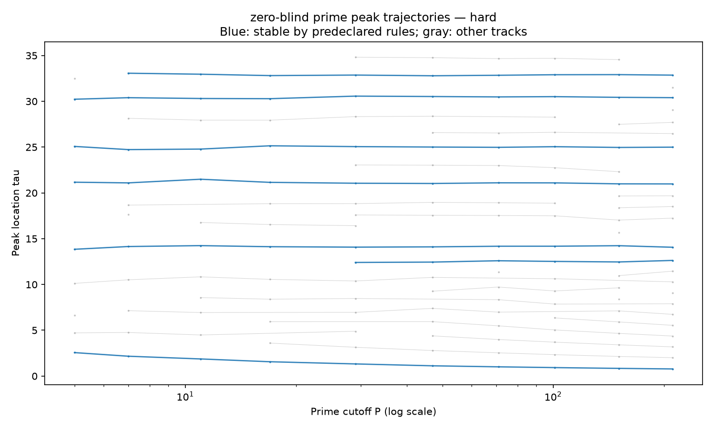
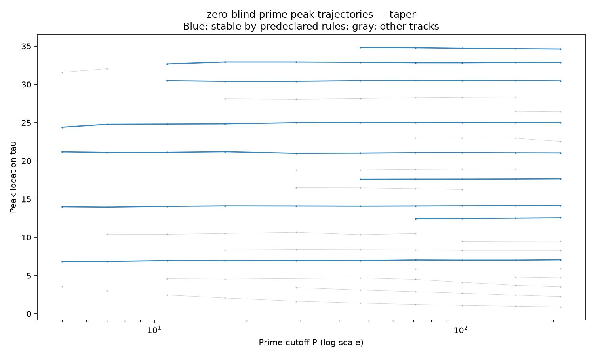
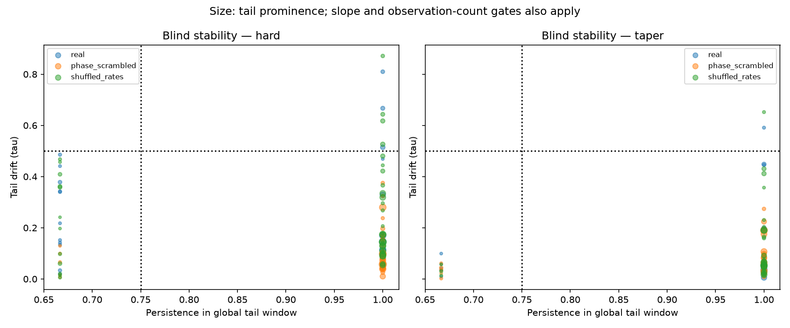
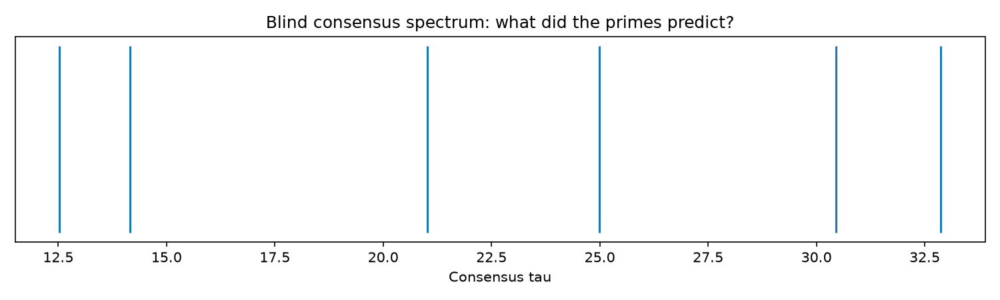
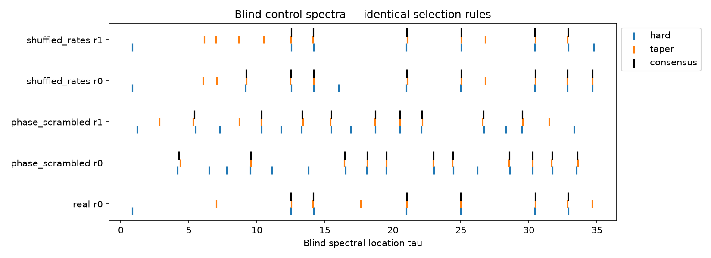

# Frozen blind prime-spectrum results

Read [blind notes](blind_summary.txt), [parameters](blind_parameters.json), and [integrity manifest](blind_freeze.json).

Smoke runs verify plumbing only. Evaluation files, if present, were made after the freeze.

