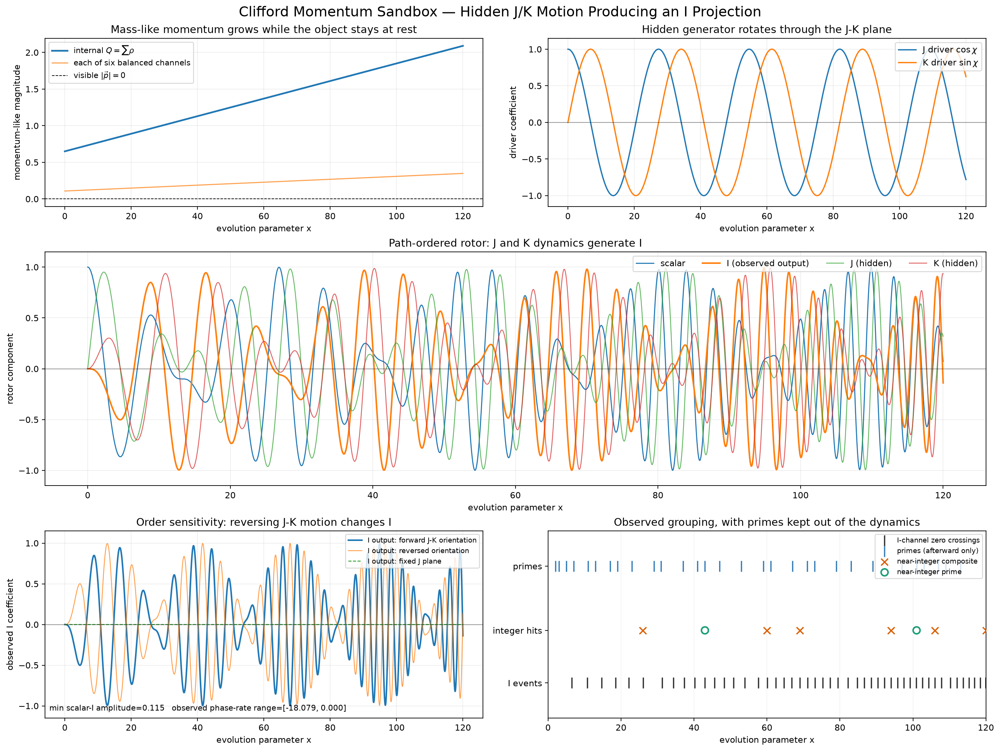

# Ordered Clifford internal momentum

Explore a speculative quaternion construction with six balanced directional
channels, a prescribed internal magnitude `Q(x)`, and a hidden generator rotating
in the J/K plane. Midpoint ordered rotations evolve a unit quaternion. The plots
compare its observed I component under forward, reversed, and fixed orientations.
Prime labels are added only after the I-channel crossings are found.

This construction is not the free scalar Klein-Gordon equation or a demonstrated
mass-generation mechanism. `Q` is prescribed; its growth would require an energy
source in a physical interpretation. The separate prime-frame experiment introduces
no such mass-like model.

From the repository root:

```powershell
.\.venv\Scripts\python.exe .\experiments\clifford_momentum\clifford_momentum_sandbox.py --no-show
```

Options include `--duration`, `--points`, `--q0`, `--momentum-growth`,
`--orientation-rate`, and `--tolerance`. Each run saves [the plot](results/figure.png),
[diagnostics](results/figure.txt), and [settings](results/figure.json).
Omit `--no-show` for a window or use `--save PATH.png` for a named variant.


