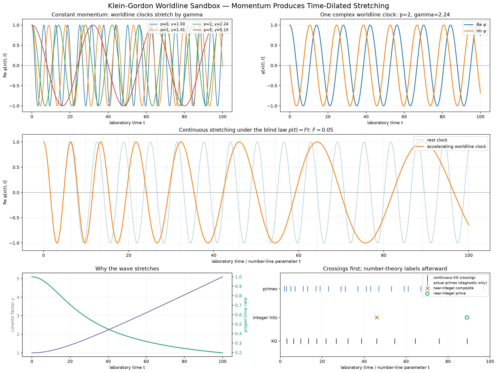

# Klein-Gordon worldline clock

Compare the phase of a KG plane wave at fixed laboratory position with its phase
along a particle's worldline. In natural units, the worldline phase rate is
`m/gamma`; with the prescribed force law `p(t)=F*t`, integrating proper time
produces continuous clock stretching. Primes are compared with near-integer
zero crossings only after the dynamics have been computed.

This is a control experiment about time dilation. It does not generate a prime
sequence or establish a prime/mass relation. The mass and force are input parameters.

From the repository root:

```powershell
.\.venv\Scripts\python.exe .\experiments\kg_worldline\kg_sandbox.py --no-show
```

Options include `--mass`, `--force`, `--duration`, `--view-momentum`, and `--tolerance`.
Each run saves [the plot](results/figure.png), [diagnostics](results/figure.txt),
and [settings](results/figure.json). Omit `--no-show` for an interactive window;
use `--save PATH.png` for a named variant. Saved artifacts can be opened without rerunning.


