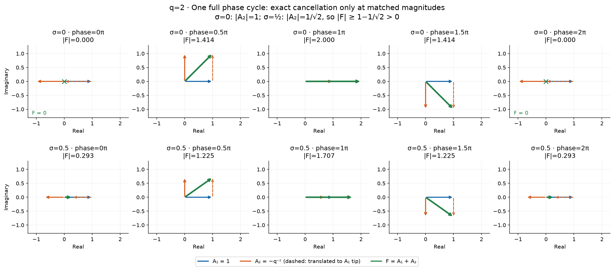
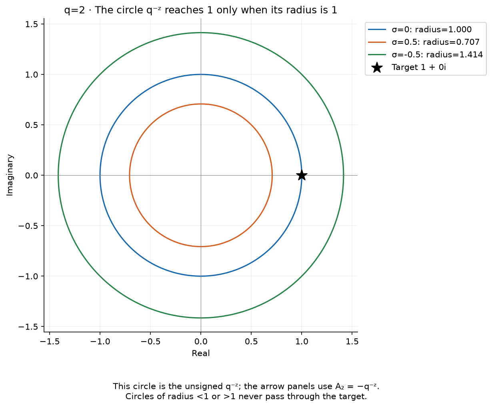
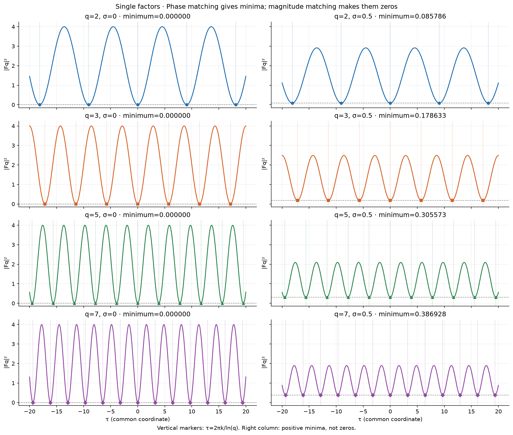
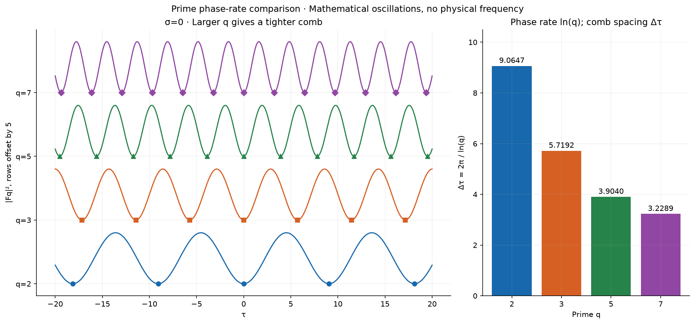
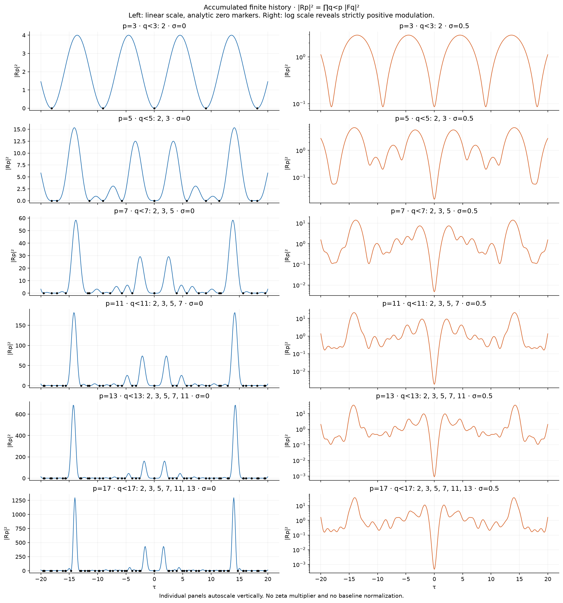
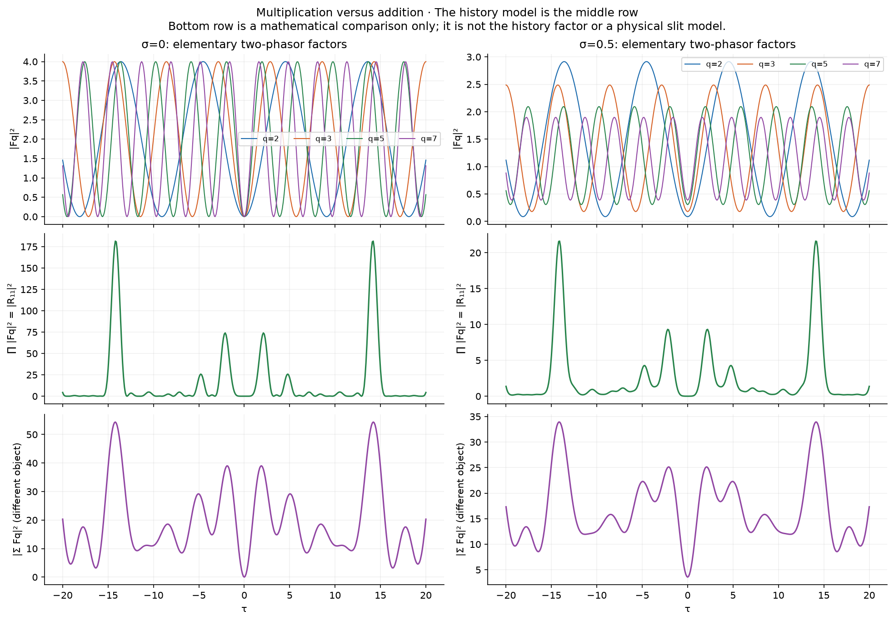
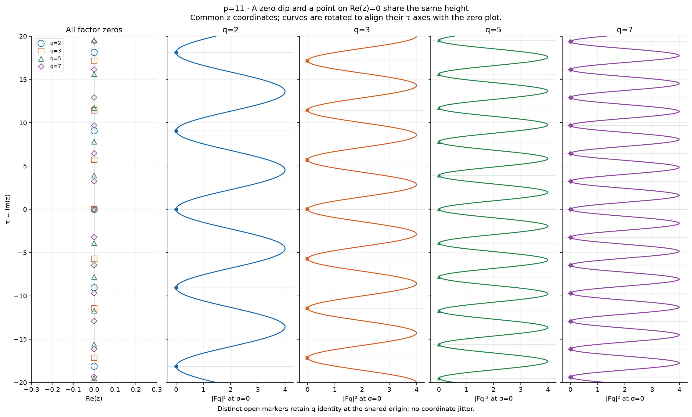
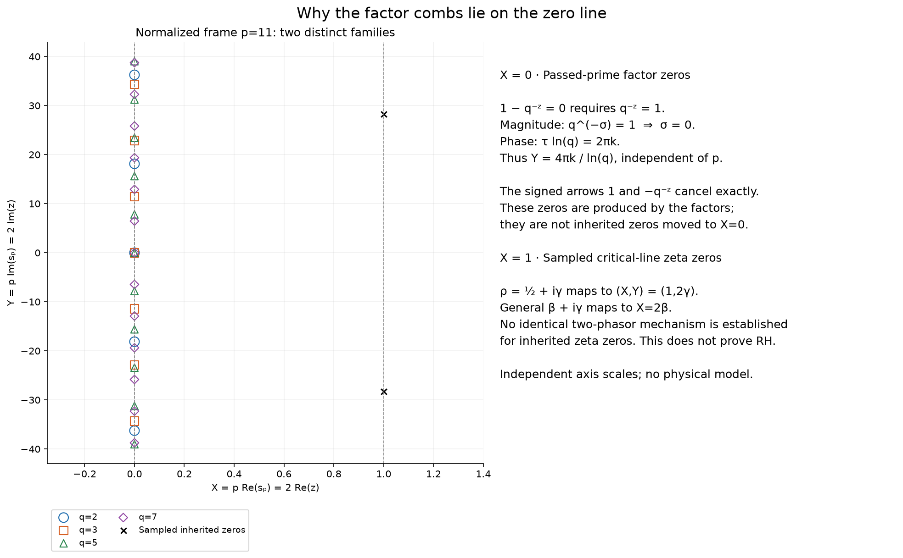
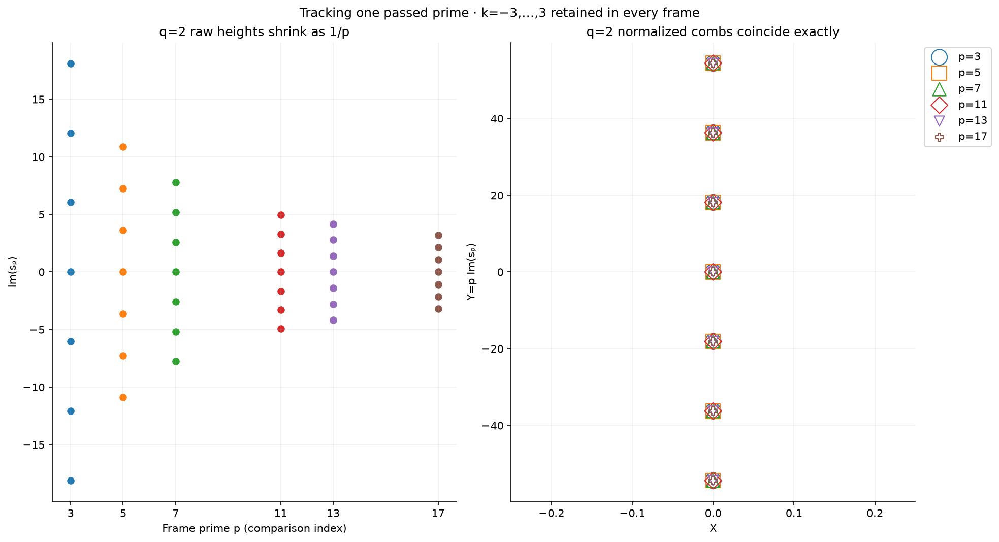

# Prime-factor phasor results

[Settings](parameters.json) | [Interpretation](summary.txt)

[Analytic zero coordinates](analytic_zeros.csv) | [Comb spacings](comb_spacings.csv) | [Sampled zeta zeros](zeta_zeros.csv)

Exact finite-factor mathematics; no physical model and no claim about the mechanism of inherited zeta zeros.

