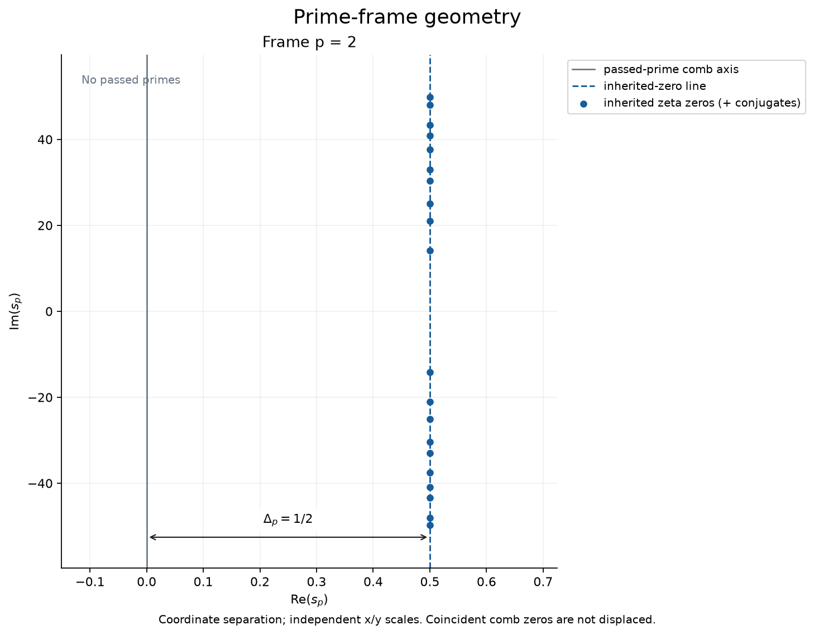
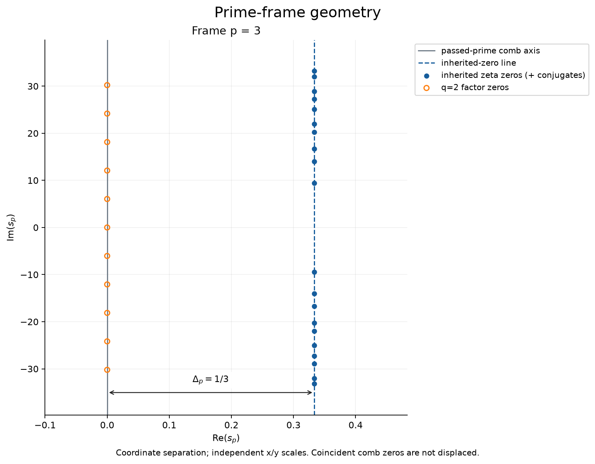
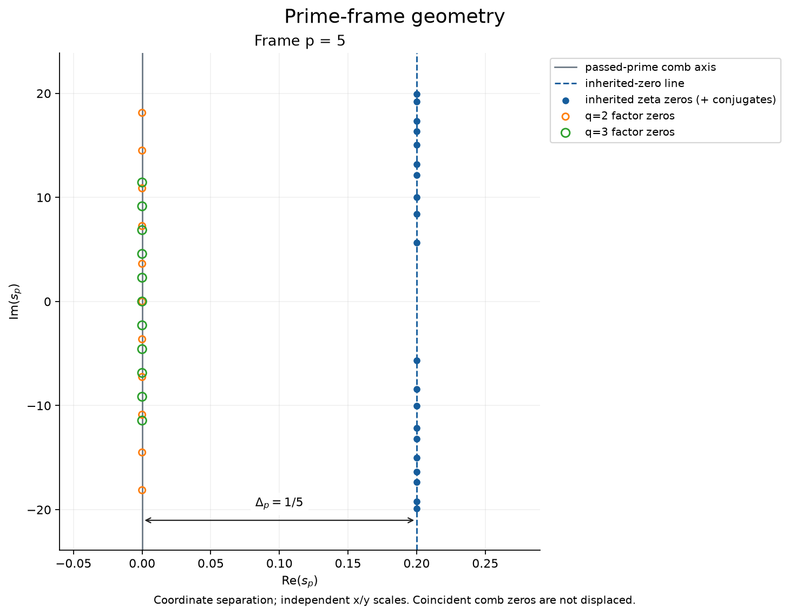
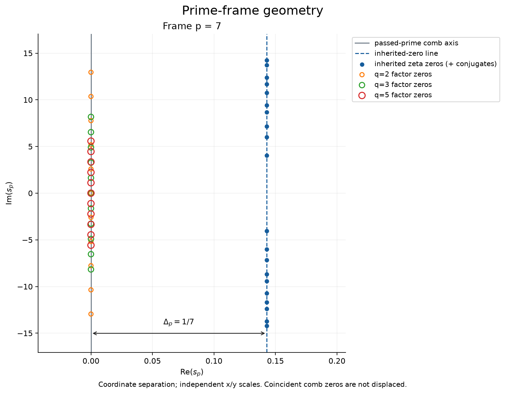
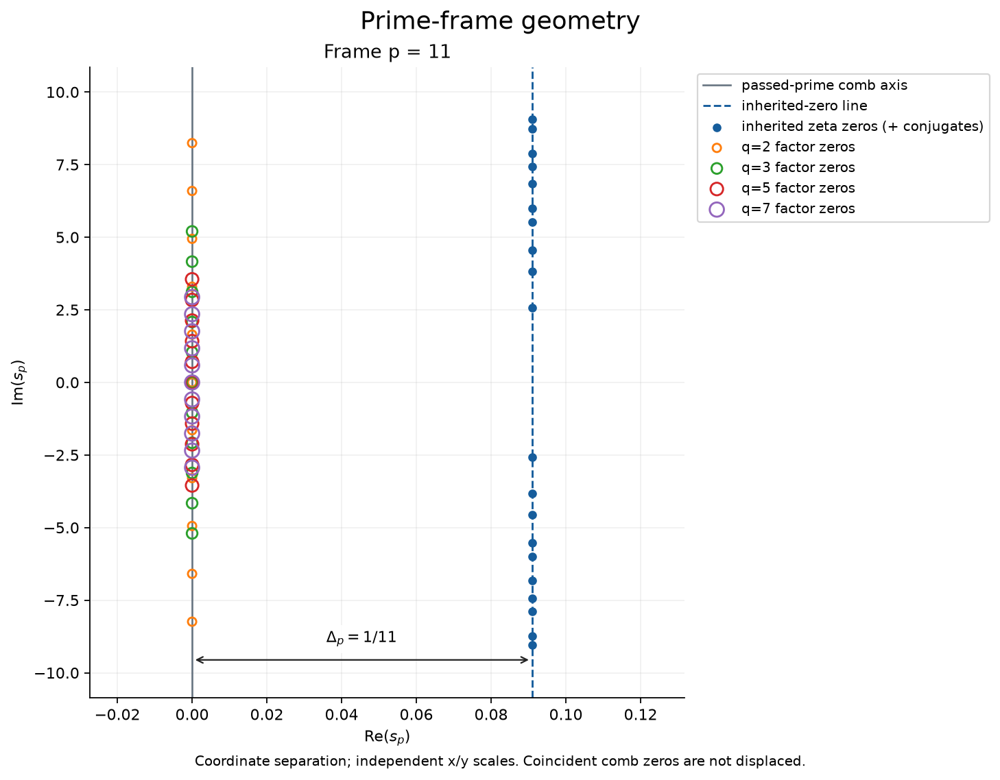
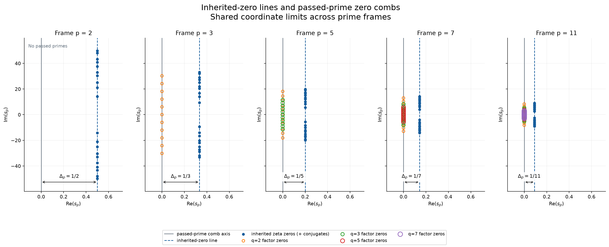
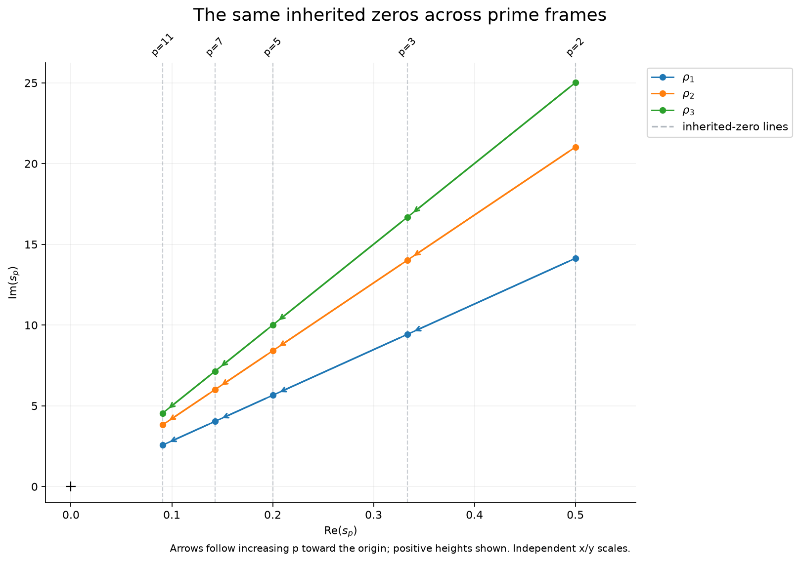
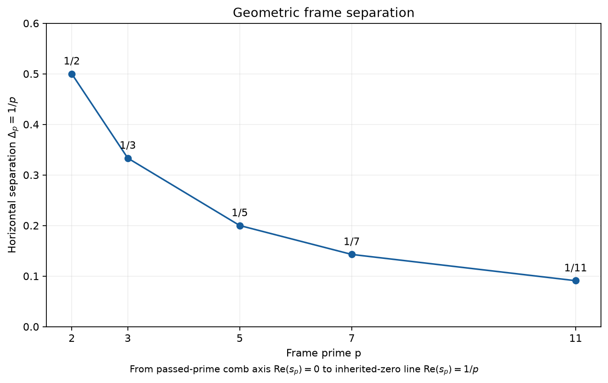

# Prime-frame geometry results

[Settings](parameters.json) | [Summary](summary.txt)

[Source zeros](zeta_zeros.csv) | [Inherited coordinates](inherited_zeros.csv) | [Comb coordinates](passed_prime_combs.csv) | [Frame gaps](frame_gaps.csv)

Critical-line samples; coordinate geometry does not establish RH or a physical gap.

