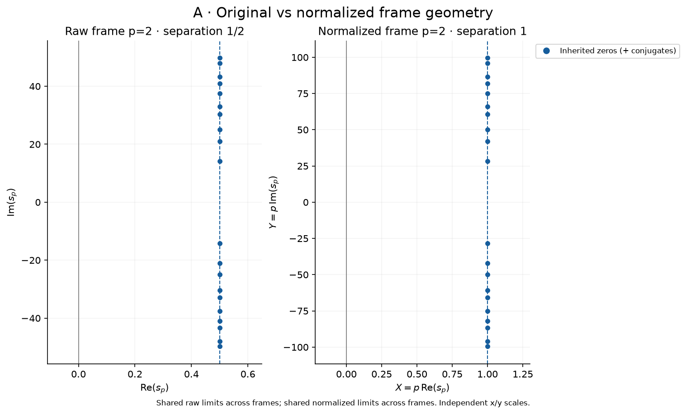
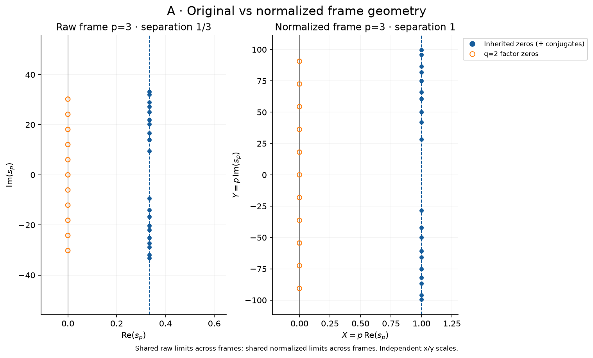
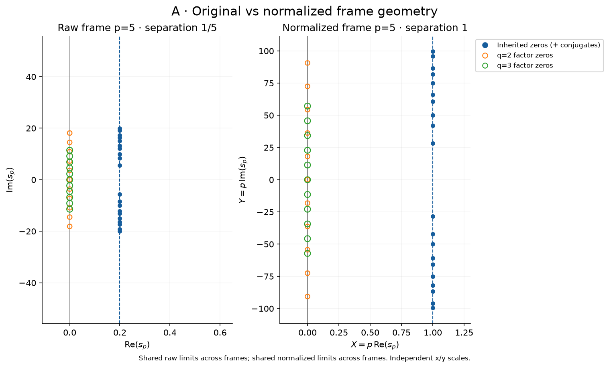
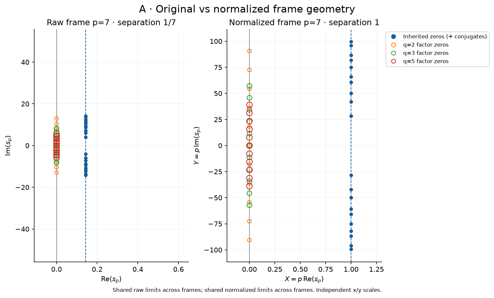
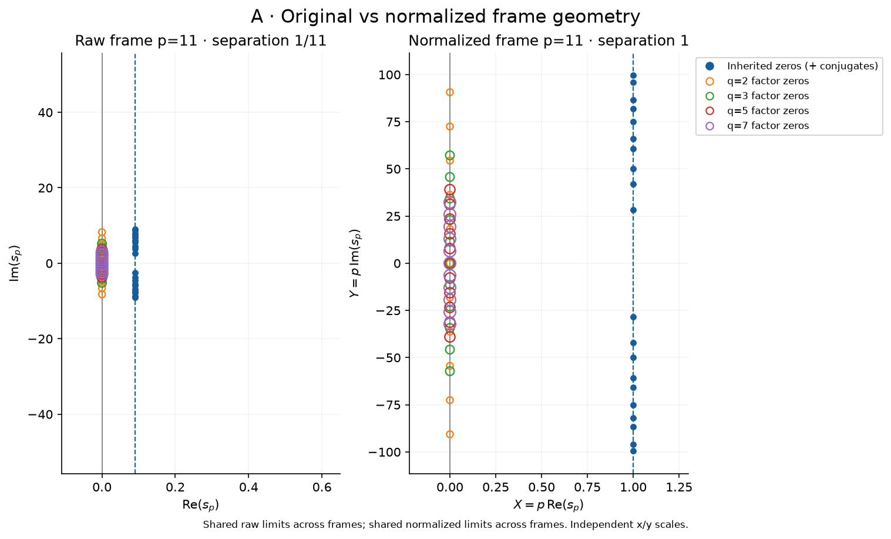
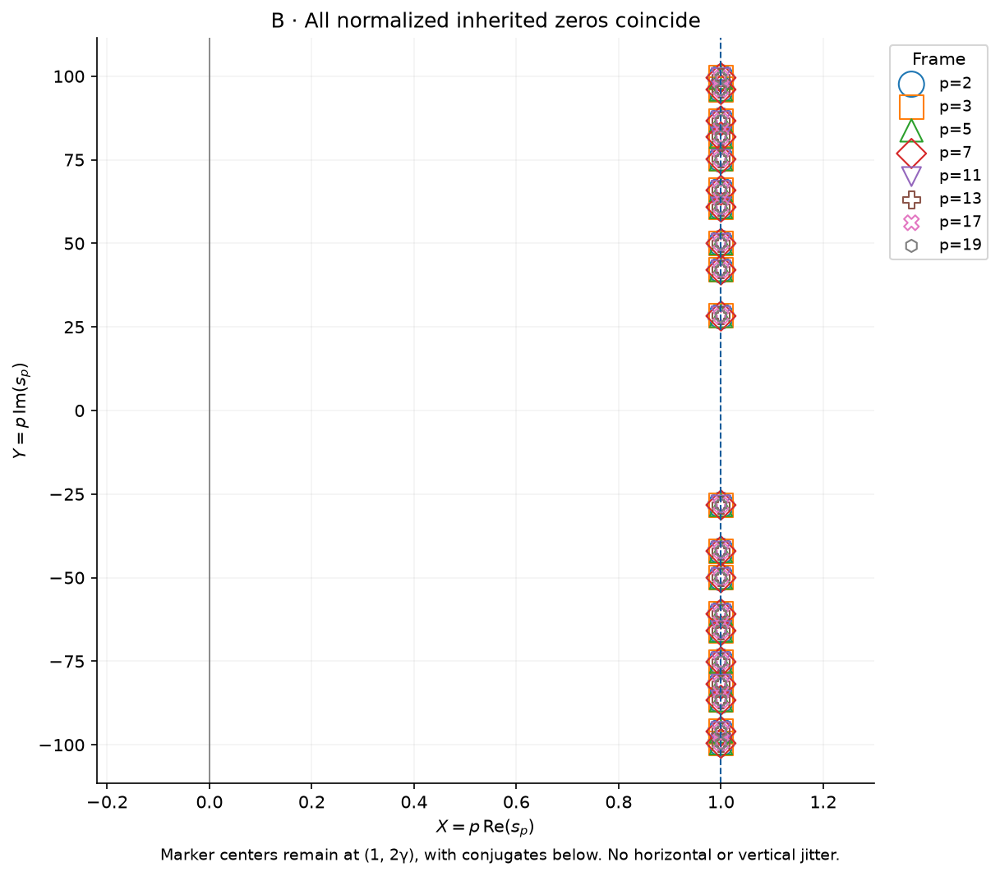
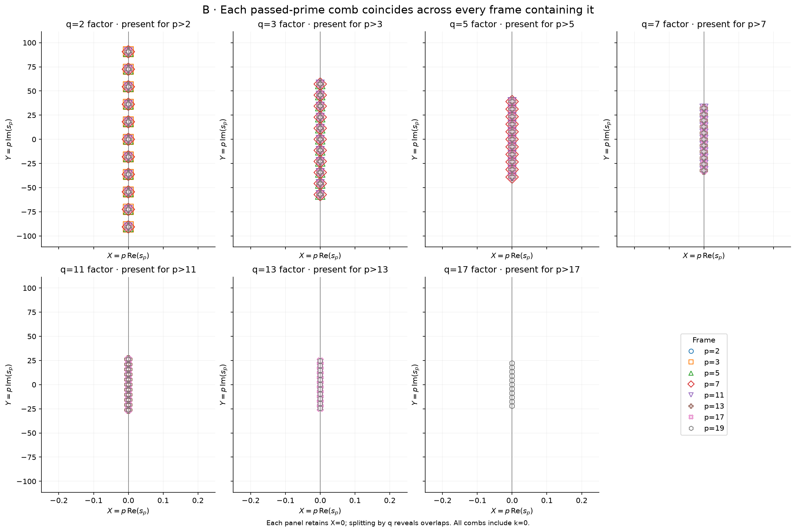
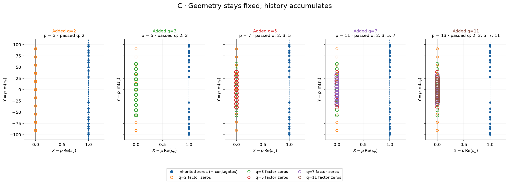
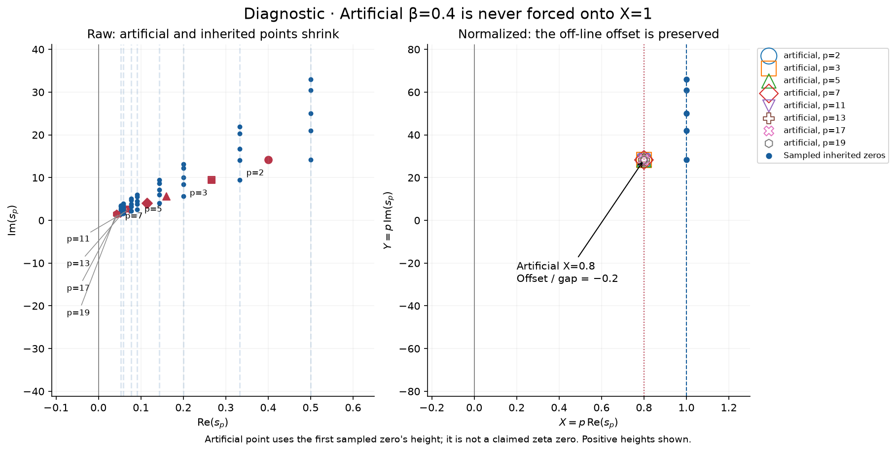

# Normalized prime-frame results

[Settings](parameters.json) | [Summary and zero tracking](summary.txt)

[Invariant checks](invariants.csv) | [Tracked zeros](tracked_zeros.csv) | [Source zeros](zeta_zeros.csv)

The collapse follows from the coordinate transformation; it supplies no new evidence for RH.

