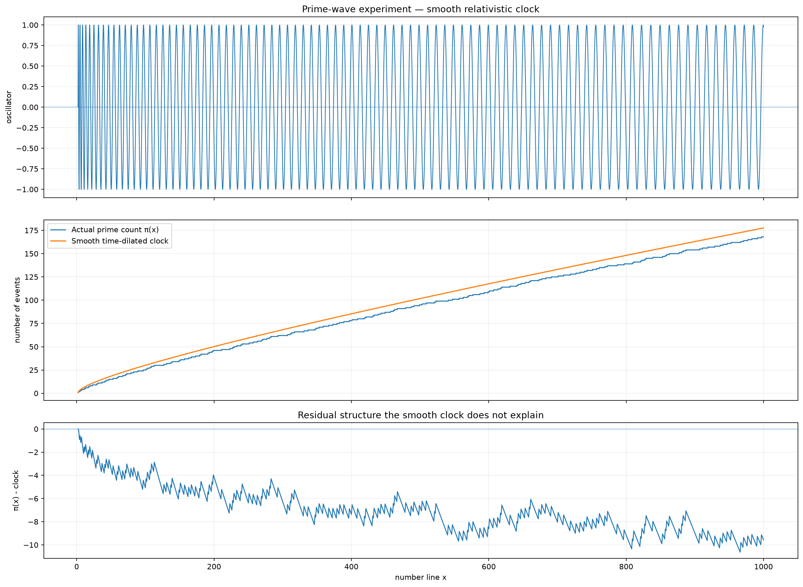

# Prime-wave clock

Explore a smooth phase rate `pi/log(x)` and compare its integrated event count
`1 + theta/pi` against the actual prime-counting function. The plot shows the
oscillator, the two counts, and the residual structure missed by the smooth clock.
The model uses `gamma(x)=log(x)/log(2)` as a toy clock prescription; agreement with
a broad trend would not establish a physical explanation or predict individual primes.

From the repository root:

```powershell
.\.venv\Scripts\python.exe .\experiments\prime_wave\prime_wave.py --no-show
```

Settings `X_MIN`, `X_MAX`, and `NUM_POINTS` remain at the top of the script.
Each run saves [the plot](results/figure.png), [the printed comparison](results/figure.txt),
and [settings](results/figure.json). Omit `--no-show` to open an interactive window too.
Use `--save PATH.png` to keep a named variant instead of replacing the default.


