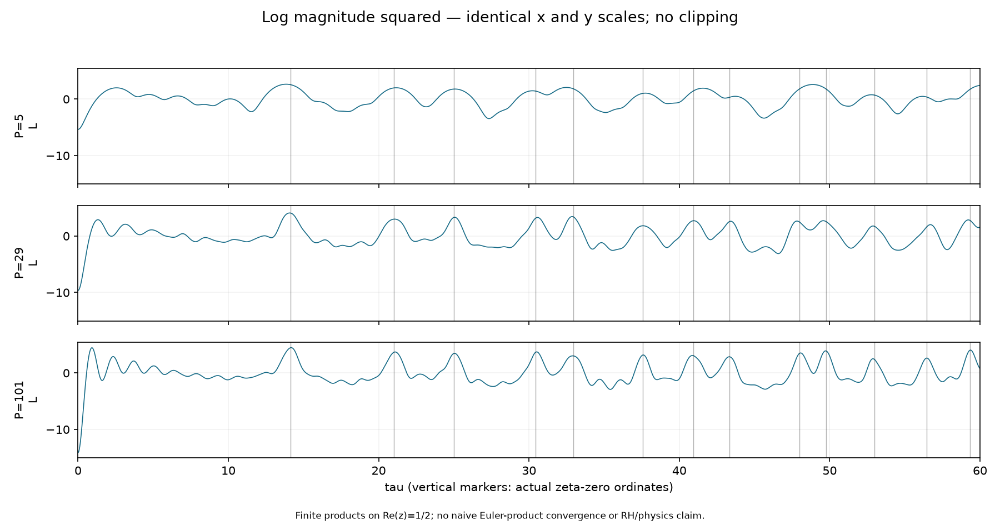
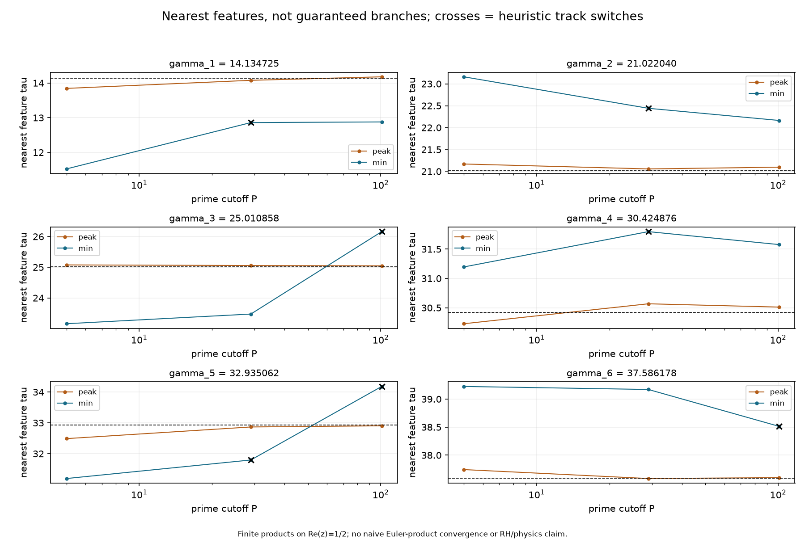
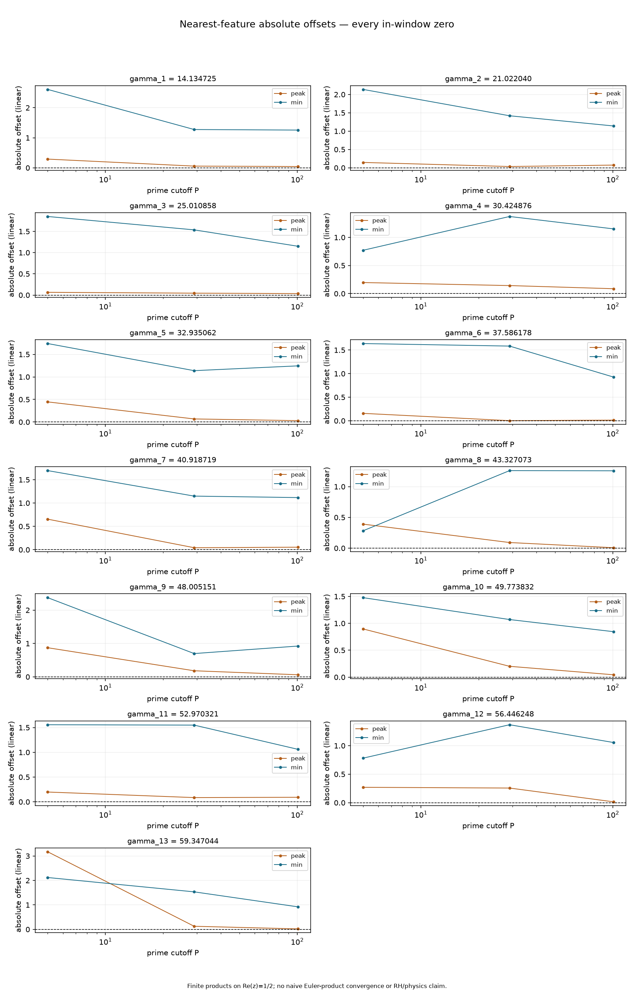
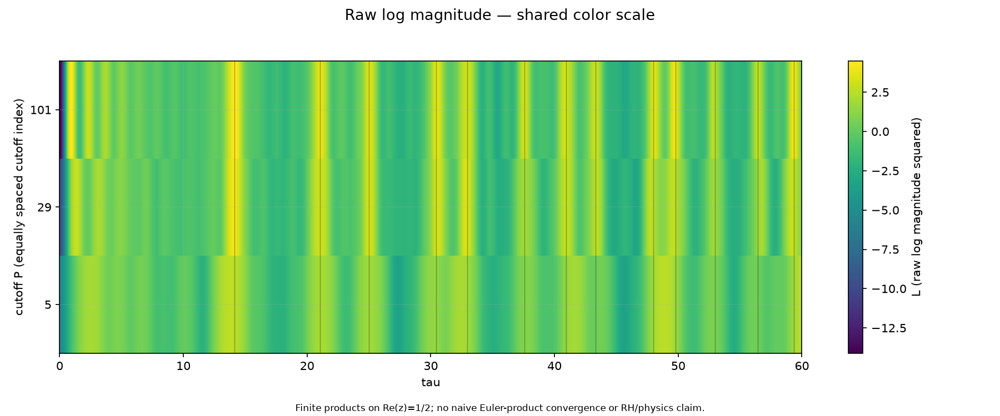
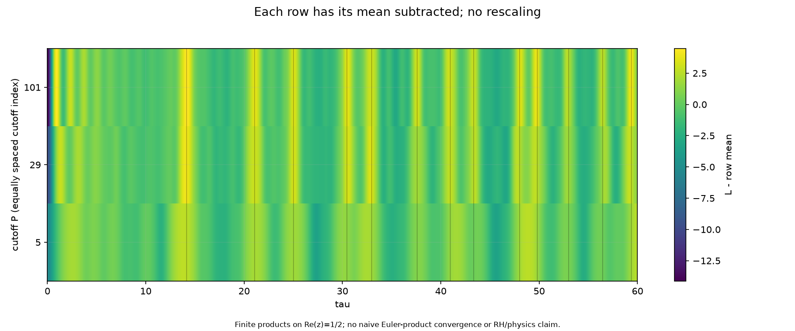
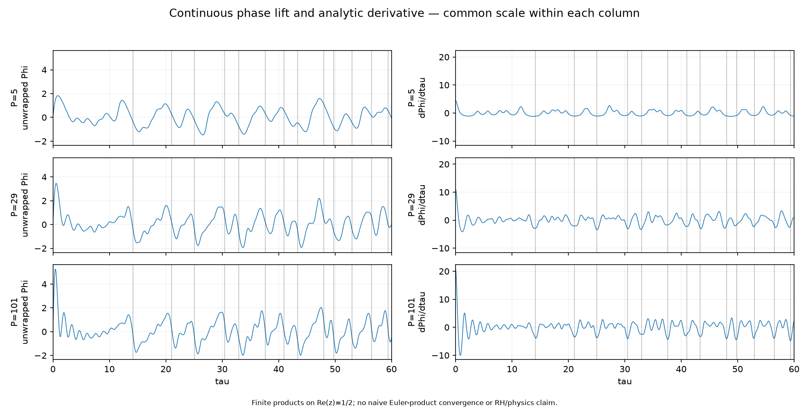
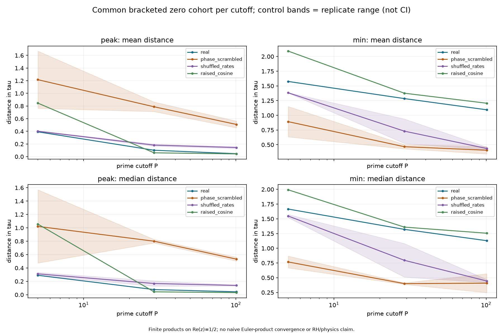
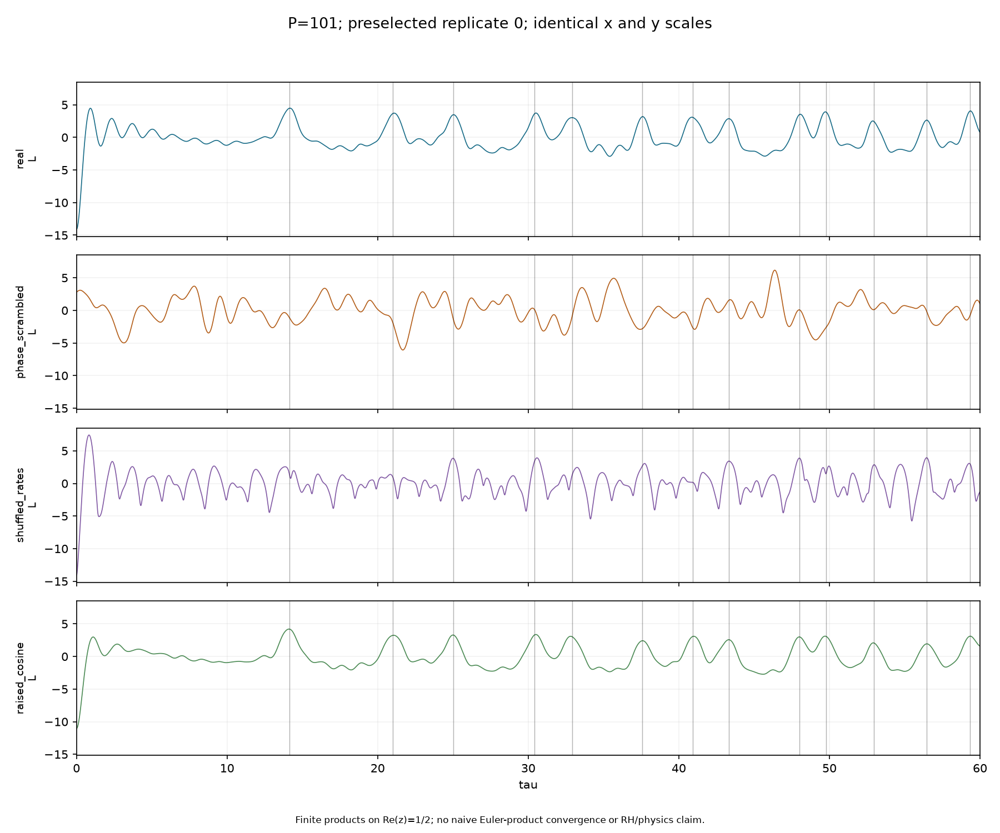
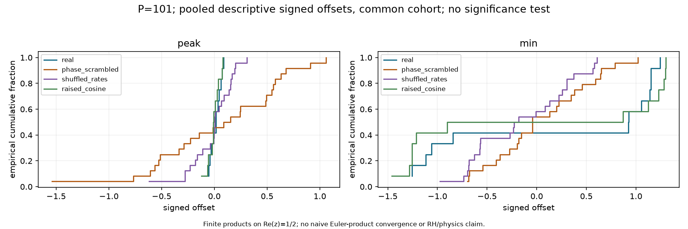
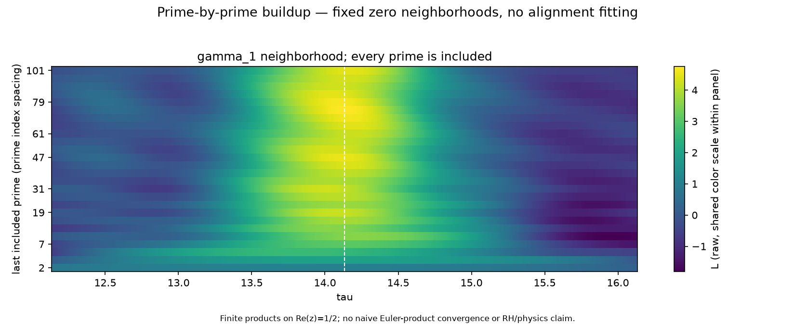

# Finite prime-product feature results

[Settings](parameters.json) | [Notes and guardrails](summary.txt)

Finite exploratory data; no convergence conclusion. Check resolution_checks.csv before interpretation.

[Nearest real features](nearest_features.csv) | [Control summaries](control_summary.csv) | [All extrema](extrema.csv)

